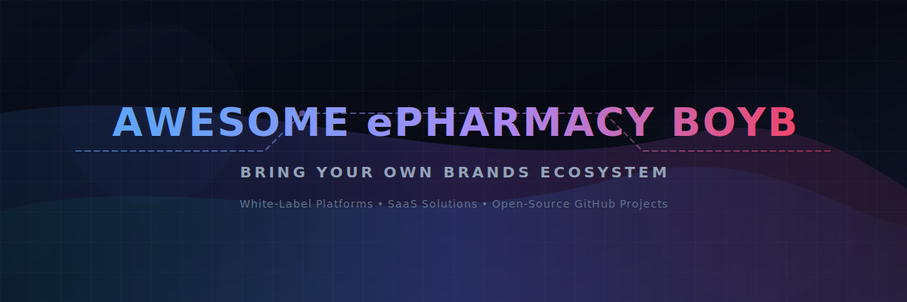

# Awesome-ePharmacy-BOYB

  

## Top ePharmacy - BOYB (Bring Your Own Brands) Ecosystem

**Curated List of SaaS Products & Open-Source GitHub Projects**  
*Focused on White-Label Pharmacy, Medicine Delivery & Custom Branded ePharmacy Platforms*  
**Last updated: March 2026**

This repository tracks notable **SaaS platforms** and **open-source projects** for **ePharmacy BOYB (Bring Your Own Brands)** solutions. These platforms enable pharmacies, startups, and businesses to launch their own branded medicine delivery apps, online pharmacies, inventory systems, and telemedicine features with full customization and ownership.

**Examples** include evitalRx, Emedstore, digitalpharmasy.io, krify, hybridplus, indglobal, trakop, appy pie gofrugal, and itecholabs (the category leaders). Tools listed here emphasize **white-label customization**, inventory management, prescription handling, delivery logistics, and compliance features.

**Open-source emphasis**: This section is heavily expanded with every major active project for self-hosting, full customization, local deployment, and complete data ownership — ideal for pharmacies, health-tech startups, and developers who want cost-effective and sovereign ePharmacy solutions.

Contributions welcome! Open a PR to add/update entries. Keep descriptions factual and link to official sites.

## 📋 Table of Contents
- [SaaS Products](#-saas-products)
- [Open-Source GitHub Projects](#-open-source-github-projects)
- [How to Contribute](#-how-to-contribute)
- [Disclaimer](#-disclaimer)

## 🚀 SaaS Products

### 💼 Core Platforms (ePharmacy BOYB)

| Product Name | Description | Company Size (Revenue / Valuation) | Pricing & Free Tier Limits |
| :--- | :--- | :--- | :--- |
| **[GoFrugal (Appy Pie)](https://gofrugal.com/)** | Retail pharmacy software with white-label and multi-store support. | ~$34M – $86M Revenue (Est. Valuation ~$102M) | Paid plans start at ~₹18,000/year. No free tier (free trial available). |
| **[iTechOLabs](https://itecholabs.com/)** | Custom ePharmacy development and BOYB solutions for healthcare businesses. | ~$17.7M Revenue (Est. Global) | Custom development pricing. No free tier. |
| **[evitalRx](https://evitalrx.com/)** | Comprehensive white-label ePharmacy platform with medicine delivery, inventory, and custom branding. | ~₹10 Cr (~$1.2M) Revenue | Paid plans start at ₹7,500/year. No free tier (free demo available). |
| **[krify](https://krify.com/)** | Custom ePharmacy development and white-label solutions with AI enhancements. | < ₹10 Cr (~$1.2M) Revenue | Custom development pricing. No free tier. |
| **[indglobal](https://indglobal.com/)** | White-label ePharmacy and healthcare software provider with full customization. | ~₹2.64 Cr (~$312K) Revenue | Custom pricing / Contact sales. No free tier. |
| **[Emedstore](https://emedstore.in/)** | BOYB-focused ePharmacy solution with strong pharmacy management and delivery features. | Undisclosed / Custom Developer | Custom pricing based on requirements. No free tier (free demo available). |
| **[trakop](https://trakop.com/)** | Logistics and pharmacy management platform for branded delivery services. | Undisclosed / B2B SaaS | Paid plans start at ~$59/month. No free tier (free demo available). |
| **[hybridplus](https://hybridplus.in/)** | Hybrid ePharmacy platform supporting both online and offline operations with branding. | Undisclosed / Early-stage (Est. 2022) | Custom/milestone-based development pricing. No free tier. |
| **[digitalpharmasy.io](https://digitalpharmasy.io/)** | Modern white-label platform for building branded online pharmacies. | Undisclosed | Custom pricing / Contact sales. No free tier. |

### 🌟 Advanced & Specialized Platforms

**Other notable mentions**: Various health-tech white-label providers and pharmacy management systems.

## 🔓 Open-Source GitHub Projects

### 🛠️ Dedicated ePharmacy & White-Label Solutions

- **[Odoo Pharmacy Modules](https://github.com/odoo/odoo)**   
  Full open-source ERP with pharmacy, inventory, sales, and delivery modules that can be branded as your own ePharmacy.

- **[ERPNext Healthcare](https://github.com/frappe/erpnext)**   
  Open-source ERP with strong healthcare and pharmacy management features, easily customized into a white-label solution.

- **[MedusaJS + Pharmacy Extensions](https://github.com/medusajs/medusa)**   
  Headless commerce engine ideal for building custom branded ePharmacy stores with medicine catalogs and delivery.

- **[Bagisto](https://github.com/bagisto/bagisto)**   
  Laravel-based open-source ecommerce platform with strong customization for ePharmacy use cases.

- **[Saleor](https://github.com/saleor/saleor)**   
  Open-source headless commerce platform with excellent support for health product catalogs and custom branding.

- **[Spree Commerce](https://github.com/spree/spree)**   
  Ruby on Rails open-source ecommerce framework suitable for building white-label pharmacy marketplaces.

- **[WooCommerce + Pharmacy Plugins](https://github.com/woocommerce/woocommerce)**   
  Most popular open-source ecommerce solution that can be extended into a full branded ePharmacy.

- **[Dolibarr ERP/CRM](https://github.com/Dolibarr/dolibarr)**   
  Lightweight open-source ERP with pharmacy modules.

- **[OpenEMR](https://github.com/openemr/openemr)**   
  Leading open-source electronic health records and medical practice management system with pharmacy and inventory modules suitable for ePharmacy customization.

- **[Tryton](https://github.com/tryton/tryton)**   
  Open-source business solution with health extensions.

- **[GNU Health](https://github.com/gnuhealth/gnuhealth)**   
  Open-source hospital and pharmacy management system with strong customization potential.

- **[OpenClinic GA](https://github.com/openclinic/openclinic)**   
  Open-source medical information system with pharmacy management capabilities.

### 💡 Additional Strong Open-Source Options

- **[n8n + Odoo** workflows for automated pharmacy delivery and order processing.
- **[LangGraph Pharmacy Agents** for building AI-powered inventory and prescription agents.
- Many community **medicine catalog** and **ePharmacy** templates built on MedusaJS and Saleor.

**Frameworks for building custom BOYB platforms**: Combine **Odoo**, **ERPNext**, **MedusaJS**, and **WooCommerce** with **n8n** and **Ollama** to create fully sovereign, AI-enhanced white-label ePharmacy solutions.

## 🤝 How to Contribute

1. Fork the repo.
2. Add/edit entries in `README.md` (follow existing format).
3. Include: name, link, 1–2 sentence description, and whether it's SaaS or open-source.
4. Submit PR with a short explanation.

Star the repo if you find it useful!

## ⚠️ Disclaimer

- This is a **community-curated** list — not exhaustive and not an endorsement.
- ePharmacy solutions must comply with local drug regulations, licensing, and data privacy laws (e.g., HIPAA, GDPR).
- Self-hosted open-source solutions require proper security, compliance, and maintenance.

---

**Made for pharmacists, health-tech entrepreneurs, and digital pharmacy operators.**  
Let's make ePharmacy solutions more accessible, customizable, and sovereign.
